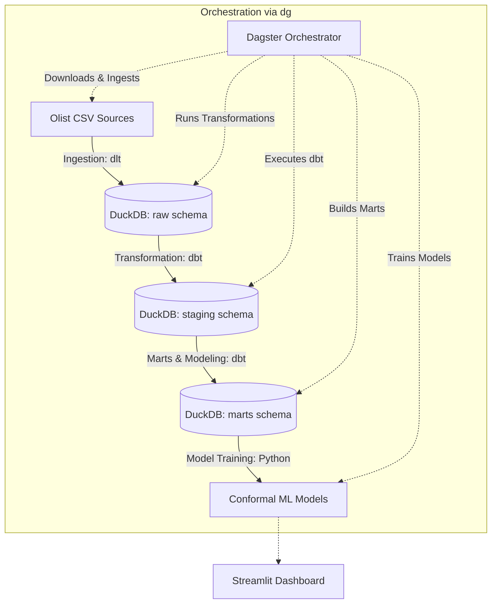

# Olist Data Warehouse Demo (orca-demo)

A complete, orchestrated local data warehouse and predictive ML demo using **dlt** (data load tool) for ingestion, **dbt** for transformation, **DuckDB** as the local database engine, **Dagster** orchestration, and **Streamlit** for interactive model validation and analytics.

The dataset used is the public Kaggle Brazilian E-Commerce dataset by Olist.

---

## Architecture Overview



- **Ingestion (`dlt`)**: Downloads raw CSV files from the source repository and loads them directly into DuckDB's `raw` schema with auto-schema detection and normalization.
- **Transformation (`dbt`)**: 
  - **Staging (`staging` schema)**: Cleanses, casts, and prepares raw tables.
  - **Marts (`marts` schema)**: Builds dimension and fact tables for analytical queries.
- **Machine Learning**: Uses Conformalized Quantile Regression (CQR) to train interval-based predictive models for delivery delays, storing trained model binaries locally.
- **Orchestration (`dg` / Dagster)**: Asset-based orchestration that manages the entire lifecycle, automatically compiling the dbt manifest and ensuring correct execution order.
- **Visualization (`Streamlit`)**: A rich interactive dashboard to explore delivery performance, model predictions, and evaluate conformal prediction coverage.

---

## Directory Structure

```text
├── orchestration/         # Dagster orchestration code and asset definitions
│   ├── assets/            # Dagster asset definitions (ingestion, transformation, ml)
│   └── definitions.py     # Main Dagster definitions file
├── transformation/        # dbt project directory
│   ├── models/            # Staging and Marts SQL models
│   ├── dbt_project.yml    # dbt project configuration
│   └── profiles.yml       # DuckDB profile configuration
├── ingestion/             # dlt pipeline scripts
│   ├── download_data.py   # Helper script to download dataset CSVs
│   └── olist_dlt_pipeline.py
├── analysis/              # Data analysis and Streamlit dashboard
│   ├── streamlit_app.py   # Streamlit dashboard application
│   ├── model_training.py  # Model training pipeline script
│   └── metrics.py         # Evaluation and validation metrics helper
├── data/                  # Git-ignored local data directory
│   ├── raw/               # Downloaded raw CSV datasets
│   └── dev.duckdb         # DuckDB local database file
├── pyproject.toml         # Project dependencies and metadata
└── README.md              # Project documentation
```

---

## Getting Started

### 1. Prerequisites
Ensure you have [uv](https://github.com/astral-sh/uv) installed.

### 2. Setup Virtual Environment & Install Dependencies
Install the package dependencies and set up the virtual environment:

```bash
# Install dependencies and create virtual environment
uv sync

# Activate virtual environment
source .venv/bin/activate
```

### 3. Launch the Orchestrator
To launch the Dagster development server, run:

```bash
dg dev
```
Open [http://localhost:3000](http://localhost:3000) in your browser. 

From the UI, click **Materialize All** to trigger the complete end-to-end flow. The orchestrator will automatically:
1. Generate the required dbt manifest.
2. Download and ingest the raw CSV datasets into DuckDB.
3. Build and test the `dbt` staging and marts layers.
4. Run the machine learning training pipeline to generate the model artifacts.

### 4. Run the Streamlit Dashboard
Once materialization is complete and the models are trained, you can launch the interactive Streamlit dashboard:

```bash
uv run streamlit run analysis/streamlit_app.py
```
Open [http://localhost:8501](http://localhost:8501) in your browser to view the delivery delay analytics and interact with the conformal prediction models.

---

## Data Model & Schema Details

- **Raw Layer (`raw` schema)**: Direct ingestion of source CSVs: `customers`, `order_items`, `order_payments`, `order_reviews`, `orders`, `products`, `sellers`, and `product_category_name_translation`.
- **Staging Layer (`staging` schema)**: Basic casting, renaming, and cleanups for downstream models.
- **Marts Layer (`marts` schema)**: Formatted business datasets such as order detail aggregates and customer/seller analysis.
